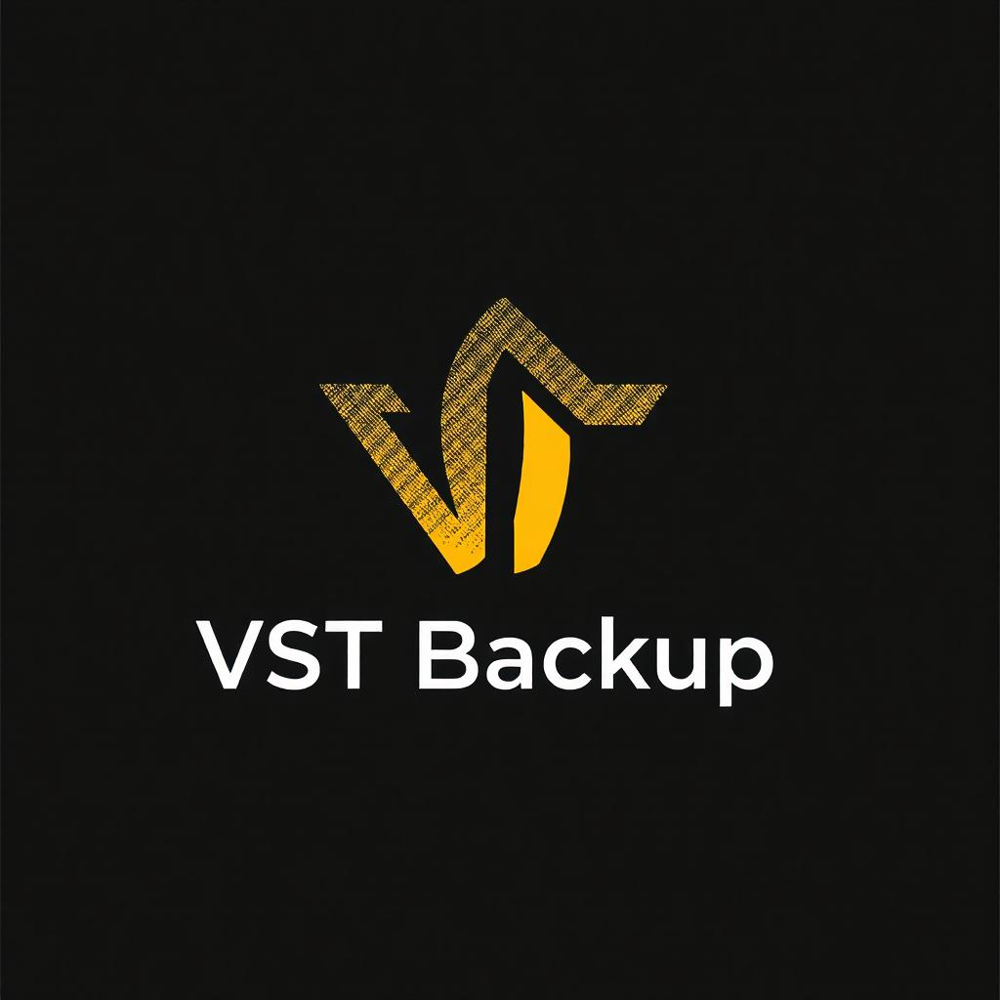

# VST Backup

### VST Plugin Backup and Organization Tool

**VST Backup** is an **open-source desktop application** designed to back up your VST plugins and organize them efficiently. This software allows you to back up plugins with extensions such as **.dll** and **.vst3**, making it easy to keep your plugin library organized and secure.

## 🚀 Installation

Follow these steps to get started with VST Backup:

### Download

[Click here to download the installer](https://your-download-link.com)

2. **Run the installer** and follow the on-screen instructions.
3. **Launch the application:** Run VSTBackup.exe on your Windows system.
4. **Start backing up and organizing your VST plugins!**

VST Backup uses [PyInstaller](https://www.pyinstaller.org/) to simplify installation and the creation of the executable.

## 🌟 Key Features

- **Efficient plugin organization:**
  VST Backup not only backs up your plugins but also organizes them. It allows you to arrange plugins in folders by name, type, or version, making your collection management much easier and more organized.

- **Backup of .dll and .vst3 formats:**
  You can back up your plugins in **.dll** and **.vst3** formats, ensuring that your entire plugin library is backed up, regardless of the format.

- **Directory selection:**
  Easily select the directories where your VST plugins are located and specify the backup location to store them in an organized manner.

- **Real-time tracking:**
  The application shows a real-time progress bar while backing up and organizing your plugins, so you always know what stage the process is at.

- **Error handling and logs:**
  If any error occurs during the backup process, the system captures it and displays it in the log, helping you quickly resolve issues.

- **User-friendly interface:**
  VST Backup is designed to be easy to use, with an intuitive interface that allows you to back up and organize your plugins with just a few clicks.

- **Open-source and customizable:**
  VST Backup is available under the **MIT License**, allowing you to freely modify and extend its functionality as per your needs.

## 🛠️ How to Use

1. **Launch the application:** Run VSTBackup.exe as an administrator for optimal performance.
2. **Select your plugin directories:** Click on "Select Plugin Directory" to add the folders where your VST plugins are located.
3. **Choose the backup location:** Click on "Select Backup Directory" to choose where you want to store the organized backup.
4. **Start the backup process:** Click the **Start Backup** button to begin. The program will copy your plugins to the selected location and organize them into specific folders.
5. **Monitor progress:** You can track progress through the visible progress bar in the interface.
6. **Cancel the backup (if needed):** If you wish to stop the process, click **Cancel Backup**.
7. **Check the logs:** If any errors occur, the error log will be displayed in the corresponding section so you can review and fix any issues.

## 📸 Screenshots

## 📊 System Requirements

- **Operating System:** Windows 10 or higher.
- **RAM:** Minimum 4 GB, recommended 8 GB or more.
- **CPU:** Multi-core processor (Recommended for faster processing).
- **Storage:** Sufficient space for output files, depending on the number and size of plugins.

## 📜 Credits and License

VST Backup relies on various third-party libraries, including:

- **PyQt5** - Framework for the graphical user interface.
- **shutil** - Standard Python library for file handling.
- **os** - For system-level operations such as file path manipulation.

VST Backup is distributed under the **MIT License**. See the [LICENSE](LICENSE.md) file for more details.

## 🛠️ Development

- **PyQt5** - Framework used for building the user interface.
- **shutil** - Standard Python library for file operations.
- **Python** - Central programming language.

## 🤝 Contributions

Contributions are welcome! To collaborate:

1. **Fork** the repository and create a new branch.
2. **Make your improvements** or fixes.
3. **Submit a pull request** with a clear description of the changes.

If you have feedback, bug reports, or suggestions, contact us at [sellocasadenubes@gmail.com](sellocasadenubes@gmail.com).

---

**VST Backup** is an open-source project that will continue to evolve with regular updates. Protect your VST plugin collection and keep it organized with ease. 🚀
